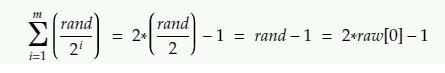

# Problem Description:
We were provided with 64 encoded messages and the sourcecode used to generate them. The task was to siply decrypt the communication by knowing the first random number used (r0) which was given in the problem statement. 

## Difficulty:
This was a medium-diffuculty Crypto challenge solved by 45/665 teams

## The code:
```python
def get_seed(l):
	seed = 0
	rand = random.getrandbits(l)
	raw = list()
	
	while rand > 0:
		rand = rand >> 1
		seed += rand
		raw.append(rand)
	
	if len(raw) == l:
		return raw, seed
	else:
		return get_seed(l)

def encrypt(m):
	l = len(m)

	raw, seed = get_seed(l)
	random.seed(seed)

	with open('encrypted.txt', 'w') as f:	
		for i in range(l):
			r = random.randint(1, 2**512)
			if i == 0:
				print("r0 =",r)
			encoded = hex(r ^ m[i] ^ raw[i])[2:]
			f.write(f"F{i}:  {encoded}\n")
```

## Initial Stage - Observations:
By analyizing the code, we can see a couple of things:
   * The raw list is filled with multiples of the initial random number (rand) generated by the 64bit seed.
     raw[0] = rand/2
     raw[1] = rand/4
     raw[2] = rand/8
     ...
     raw[log(rand)] = rand/2^(log(rand-1)) = 1
   * The seed returned back to the encryption function is the sum of raw[i] for every 0<=i<=m, where m=log(rand)
   	
   * If we have the initial seed then we can recreate the encryption process.

## Working the numbers:

r -> random

From the source code
```python
encoded[i] = hex(r[i] ^ m[i] ^ raw[i])[2:]
```
The encoded[0] is the first message of the communication
encoded[0] = 17e5b42a8bea57da669427727314c1b5b50a7c11135d48d87fac2aa91c1e96a62c3e815724c0fd9fd338fa7d65e390525a1294fbaa2655e563657b5e699bb732 = hex(r ^ m[i] ^ raw[i])[2:]

=> r[i] ^ m[i] ^ raw[i] = 1251602129774106047963344349716052246200810608622833524786816688818258541877890956410282953590226589114551287285264273581561051261152788396719615239763762 = decoded[0]

r[0] = 1251602129774106047963344349716052246200810608622833524786816688818258541877890956410282953590226589114551287285264273581561051261152783001366229253687592

raw[0] = encoded[0] ^ r[0] ^ m[0]
            ^	          ^    ^	
            |		        |    |
      We have all these values thus we can caluclate raw[0]

=> raw[0] = 1251602129774106047963344349716052246200810608622833524786816688818258541877890956410282953590226589114551287285264273581561051261152788396719615239763762 ^ 1251602129774106047963344349716052246200810608622833524786816688818258541877890956410282953590226589114551287285264273581561051261152783001366229253687592 ^ ord('d')

=> raw[0] = 8926184294774128254

2) We can find the seed

=> seed = raw[0]-1 = 8926184294774128253

3) We slightly modify the code and we get the flag

```python
testing = []

def decrypt():
	l = 64
	solution = ""
	raw, seed = get_seed(l)
	print(raw,seed)
	random.seed(seed)

	for i in range(0,64):	
		r = random.randint(1, 2**512)
		print("r"+str(i)+ "=",r)
		b = 1
		for m in string.printable:
			encoded = hex(r ^ ord(m) ^ raw[i])[2:]
			if(encoded==testing[i]):
				solution += m
				b=0
		if(b==1):
			print(i)
	print(solution)
```
## The complete code
```python
#!/usr/bin/env python3
import random
import binascii
import string

def get_seed(l):
	seed = 0
	rand = 8926184294774128254*2
	raw = list()
	
	while rand > 0:
		rand = rand >> 1
		seed += rand
		raw.append(rand)
	
	if len(raw) == l:
		return raw, seed
	else:
		return get_seed(l)

testing = []

def decrypt():
	l = 64
	solution = ""
	raw, seed = get_seed(l)
	print(raw,seed)
	random.seed(seed)

	for i in range(0,64):	
		r = random.randint(1, 2**512)
		print("r"+str(i)+ "=",r)
		b = 1
		for m in string.printable:
			encoded = hex(r ^ ord(m) ^ raw[i])[2:]
			if(encoded==testing[i]):
				solution += m
				b=0
		if(b==1):
			print(i)
	print(solution)

with open('encrypted.txt', 'r') as f:
	lines = f.readlines()
	i=0
	here = "0123456789abcdef"
	for line in lines:
		r = random.randint(1, 2**512)
		s=line.split(":")[1][2:][:128]
		if(s[127] in here):
			testing.append(s)
		else:
			s=s[:127]
			testing.append(s)
		i += 1

decrypt()
#darkCON{user_W4rm4ch1ne68_pass_W4RM4CH1N3R0X_t0ny_h4cked_4g41n!}
```
