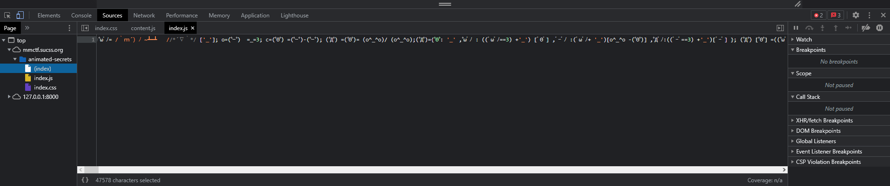
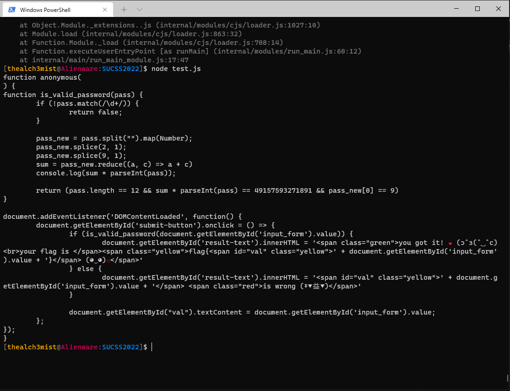
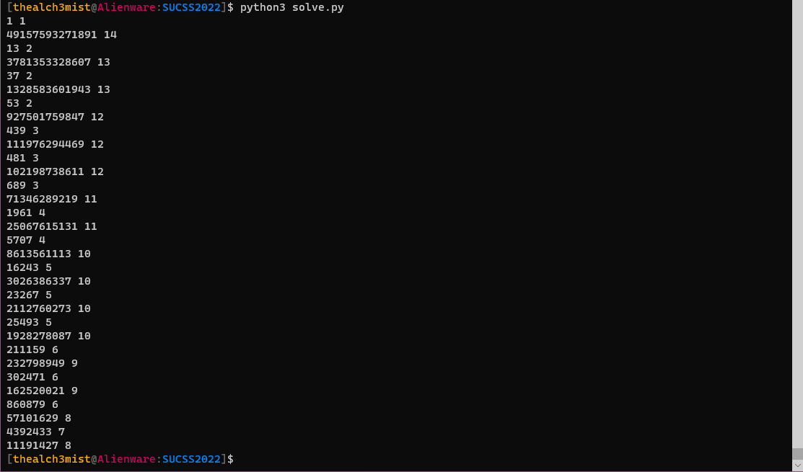

This was a medium-difficulty reverse-engineering challenge for the member-made SUCSS competition
# Interface
The challenge was redirecting us to a static website where it was requesting a password to give us the flag


Since there were no network packets pointing to a backend server or any calls to an api endpoint, the password checking should have been done locally.
By having a look at the source files I found a very strange index.js file that was clearly an obfuscated js file



So I tried to run it line by line on the console to statically deobfuscate it.

After doing a little static analysis and replacing the bits that were not recongnizable by the node compiler, I build the test.js file which I then run locally and I printed the last line - which was the obfuscated function - to see exactly what operations it was performing.



So the password checking is done by calling <b>is_valid_password(pass)</b> function which returns true if the provided password is of the requirede form
```js
function is_valid_password(pass) {
            //Must be a string of digits[0-9]
            if (!pass.match(/\d+/)) {
                    return false;
            }

            pass_new = pass.split("").map(Number);
            //get every digit 
            pass_new.splice(2, 1);
            pass_new.splice(9, 1);
            //remove 3rd and 10th digit
            sum = pass_new.reduce((a, c) => a + c)
            //sum over all digits
            console.log(sum);
            //the sum of all digits is multiplied with the initial integer representaion of the value given
            console.log(sum * parseInt(pass));
            
            return (pass.length == 12 && sum * parseInt(pass) == 49157593271891 && pass_new[0] == 9)
    }
```

We can see that the important conditions are for the password to have length 12, the sum of its digits(excluding 3rd and 10th digit) times its actual integer value to be equal to  49157593271891 and for the first digit to be 9

To solve this, we try to find all integer factors of 49157593271891 which are not that many with the following script and we select the one that starts with 9 and has length 12

```python
import math

divisors = []
for i in range(1,math.floor(math.sqrt(49157593271891))):
    if 49157593271891 %i==0:
        divisors.append(i)
        divisors.append(49157593271891//i)

for i in divisors:
    print(i,len(str(i)))
```



So we can see that the only password that fullfils these criteria is 927501759847

Thus we provide this password to the service and we get the flag:


